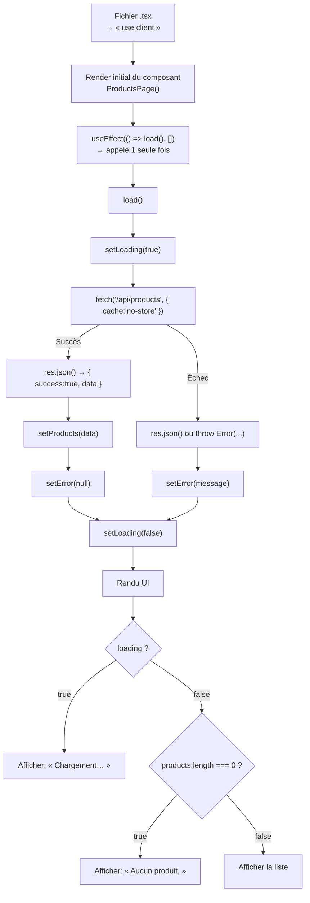
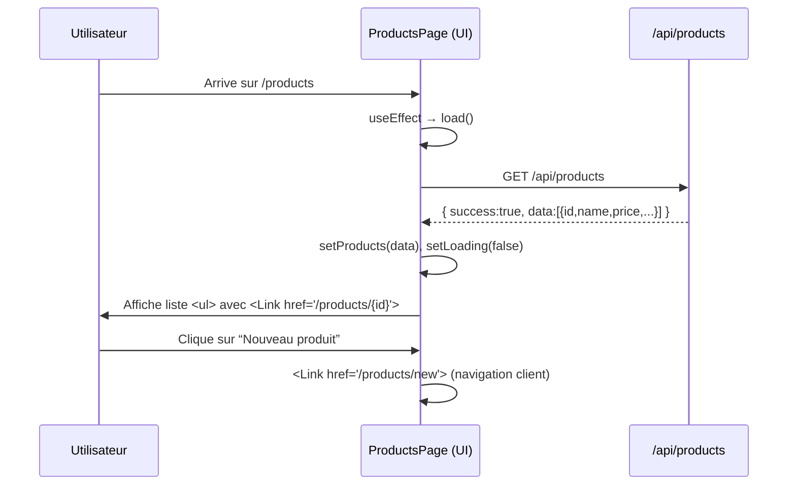
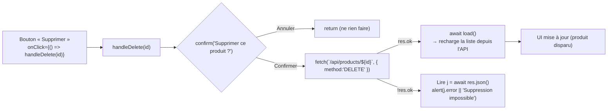

# Arborescence des fonctions

Pour chaque fonction, j'explique:

* **Ce qu’elle fait**
* **Ce qu’elle renvoie** (ou l’effet qu’elle produit)

Cela montre la logique **sans afficher le code**, juste la structure.

```
ProductsPage()  ← Composant principal (Client Component : "use client")
│
├── useState() x3
│     ├─ products       : Tableau des produits
│     ├─ loading        : Booléen (affiche "Chargement...")
│     └─ error          : Chaîne ou null (affiche message erreur)
│
├── load()  ← Fonction asynchrone de chargement
│     ├─ Met loading = true
│     ├─ Fait fetch("/api/products", { cache: "no-store" })
│     ├─ Si succès → setProducts(...) et setError(null)
│     ├─ Si erreur → setError(message)
│     └─ Met loading = false
│     ↳ Ne renvoie rien (void) mais modifie l’état → rafraîchit l’UI
│
├── useEffect( load(), [] )
│     └─ Appelé une seule fois au montage
│
├── handleDelete(id)  ← Fonction asynchrone de suppression
│     ├─ Demande confirmation à l’utilisateur
│     ├─ Si confirmé → fetch DELETE `/api/products/{id}`
│     ├─ Si succès → appelle load() pour recharger
│     └─ Si erreur → affiche un alert
│     ↳ Ne renvoie rien (void) mais modifie l’état → rafraîchit l’UI
│
└── return ( ... )
      ├─ <main> ... </main> ← JSX principal
      │
      ├─ En-tête : titre + lien "Nouveau produit"
      │
      ├─ Rendu conditionnel :
      │     ├─ loading === true → <p>Chargement...</p>
      │     ├─ error non null  → <p>{error}</p>
      │     ├─ liste vide      → <p>Aucun produit.</p>
      │     └─ sinon           → <ul> avec <li> produits
      │
      └─ Chaque <li> contient :
            ├─ Nom du produit (lien vers détail)
            ├─ Prix formaté
            ├─ Lien "Modifier"
            └─ Bouton "Supprimer" → handleDelete()
```

### Lecture vulgarisée pour les étudiants

* **ProductsPage()** : la “boîte” principale. C’est elle qui renvoie tout le code HTML (JSX) final.
* **load()** : va chercher les produits depuis l’API et met à jour l’état → rafraîchit l’affichage.
* **useEffect** : lance `load()` automatiquement dès que la page s’ouvre.
* **handleDelete(id)** : supprime un produit et recharge la liste.
* **return (...)** : c’est le HTML final que React affiche, construit en fonction de `products`, `loading`, et `error`.


<br/>


# Version complète (corrigée) avec commentaires

```tsx
// "use client"
// ↑ Directive spéciale Next.js (App Router).
//   - Placez-la TOUT EN HAUT du fichier (avant toute import/export).
//   - Dit à Next.js : “ce composant est un *client component*”.
//   - Nécessaire dès qu’on utilise des APIs client side de React (useState, useEffect),
//     le DOM, window, event handlers (onClick), etc.

"use client"

import { useEffect, useState } from "react"
// ↑ Import de deux hooks React :
//   - useState : stocker un état local (ex. la liste des produits, le statut de chargement)
//   - useEffect : exécuter un effet (ex. charger les produits après le premier rendu)

import Link from "next/link"
// ↑ Composant Link de Next.js : navigation interne côté client (sans recharger la page)

type Product = {
  id: number
  name: string
  price: number
  createdAt: string
  updatedAt: string
}
// ↑ Définition TypeScript du “shape” d’un produit reçu depuis l’API.

export default function ProductsPage() {
// ↑ Déclare et exporte le composant par défaut "ProductsPage".
//   - Un composant React = fonction qui retourne du JSX.

  const [products, setProducts] = useState<Product[]>([])
  // ↑ Etat "products" : tableau de Product, initialisé vide.

  const [loading, setLoading] = useState<boolean>(true)
  // ↑ Etat "loading" : booléen pour afficher “Chargement…”.

  const [error, setError] = useState<string | null>(null)
  // ↑ Etat "error" : message d’erreur éventuel (ou null = pas d’erreur).

  async function load() {
  // ↑ Fonction asynchrone qui charge les produits depuis l’API.
    try {
      setLoading(true) // on affiche le “spinner”/texte de chargement
      const res = await fetch("/api/products", { cache: "no-store" })
      // ↑ Appel HTTP GET vers l’API Route Next.js :
      //   - URL relative “/api/products”
      //   - { cache: "no-store" } => demande de ne pas servir depuis le cache
      //     (utile pour toujours voir les données à jour côté client)

      const json = await res.json()
      // ↑ Parse la réponse en JSON

      if (!res.ok || json.success !== true) {
        // ↑ robustesse : on valide à la fois le statut HTTP et un contrat JSON
        throw new Error(json.error || "Erreur lors du chargement")
      }

      setProducts(json.data as Product[])
      // ↑ On range le tableau renvoyé par l’API dans l’état "products".
    } catch (e: any) {
      setError(e.message) // ↑ Mémorise le message d’erreur pour l’afficher à l’écran
    } finally {
      setLoading(false) // ↑ Dans tous les cas, on arrête le “loading”
    }
  }

  useEffect(() => {
    // ↑ useEffect avec tableau de dépendances vide [] :
    //   - s’exécute 1 seule fois après le premier rendu (componentDidMount)
    load()
  }, [])

  async function handleDelete(id: number) {
    // ↑ Gestionnaire pour supprimer un produit
    if (!confirm("Supprimer ce produit ?")) return
    // ↑ Fenêtre native de confirmation ; si l’utilisateur annule, on quitte.

    const res = await fetch(`/api/products/${id}`, { method: "DELETE" })
    // ↑ Appel HTTP DELETE vers /api/products/:id

    if (res.ok) {
      await load() // ↑ Si OK, on recharge la liste (données fraîches)
    } else {
      const j = await res.json().catch(() => ({}))
      alert(j.error || "Suppression impossible")
      // ↑ Sinon, on affiche un message d’erreur
    }
  }

  return (
    <main className="container mx-auto p-8">
      {/* ↑ Balise sémantique principale ; classes Tailwind :
           - container : largeur de lecture
           - mx-auto  : centre horizontal
           - p-8      : padding 2rem
        */}
      <div className="flex items-center justify-between mb-6">
        {/* ↑ Ligne d’en-tête avec flexbox */}
        <h1 className="text-2xl font-semibold">Produits</h1>
        {/* ↑ Titre de la page */}
        <Link className="underline" href="/products/new">Nouveau produit</Link>
        {/* ↑ Lien Next.js vers la page de création */}
      </div>

      {loading && <p>Chargement...</p>}
      {/* ↑ Rendu conditionnel : si loading === true, affiche “Chargement…” */}

      {error && <p className="text-red-600">{error}</p>}
      {/* ↑ Si erreur, affiche le message en rouge */}

      {!loading && products.length === 0 && (
        <p>Aucun produit.</p>
      )}
      {/* ↑ Si pas en chargement ET tableau vide, message “Aucun produit.” */}

      <ul className="space-y-3">
        {/* ↑ Liste des produits ; space-y-3 = écart vertical entre items */}
        {products.map((p) => (
          // ↑ On itère sur le tableau en rendant un <li> par produit
          <li key={p.id} className="flex items-center justify-between border p-3 rounded">
            {/* ↑ key={p.id} : clé unique exigée par React pour lister des éléments.
                 Classes Tailwind : flex, bordure, padding, angles arrondis */}
            <div>
              <Link className="font-medium underline" href={`/products/${p.id}`}>
                {p.name}
              </Link>
              {/* ↑ Lien vers la page de détail du produit */}
              <div className="text-sm text-gray-600">
                {p.price.toFixed(2)} $
                {/* ↑ Affiche le prix avec 2 décimales.
                     Attention : toFixed formate en string (pas pour calculs).
                     Pour localisation : préférer Intl.NumberFormat. */}
              </div>
            </div>

            <div className="flex items-center gap-3">
              <Link className="underline" href={`/products/${p.id}/edit`}>Modifier</Link>
              {/* ↑ Lien vers la page d’édition */}
              <button onClick={() => handleDelete(p.id)} className="text-red-700">
                Supprimer
              </button>
              {/* ↑ Bouton qui déclenche handleDelete avec l’id du produit */}
            </div>
          </li>
        ))}
      </ul>
    </main>
  )
}
```

---

# Décryptage concept par concept

## 1) `"use client"`

* **Ce que c’est** : une directive (chaîne de caractères) interprétée par Next.js (App Router).
* **Pourquoi** : votre fichier utilise `useState`, `useEffect`, des `onClick`, `confirm`, etc. → ce sont des APIs **client**. Sans `"use client"`, Next.js considérera le composant comme **server component** et lèvera une erreur.
* **Où** : tout en haut du fichier, **avant** les `import`.

## 2) Imports

* `useEffect`, `useState` : hooks React pour gérer l’état et les effets de cycle de vie côté client.
* `Link` (Next.js) : navigation interne **sans rechargement** (router client). Toujours préférer `Link` à `<a href="/...">` pour des pages internes.

## 3) Typage `type Product`

* Décrit la **forme** d’un objet produit. Ici, `id`, `name`, `price` (un nombre), `createdAt` et `updatedAt` (chaînes ISO d’habitude).
* Sert à typer l’état `products: Product[]` et à avoir de l’autocomplétion + vérifications TypeScript.

## 4) États locaux

* `products`: la donnée métier affichée.
* `loading`: contrôle l’affichage de “Chargement…”.
* `error`: message d’erreur (affiché si défini).

> Bon réflexe : un “trio” `data / loading / error` simplifie les rendus conditionnels.

## 5) `load()` : récupération distante (fetch)

* `fetch("/api/products", { cache: "no-store" })` : appelle une **API Route** Next (fichier `app/api/products/route.ts` par ex.).
* `cache: "no-store"` : en client-side fetch, demande d’éviter le cache. Utile pour toujours refléter les dernières modifications.
* Contrat JSON attendu : `{ success: true, data: Product[] }` ou `{ success: false, error: string }`.
* En cas d’erreur HTTP (`!res.ok`) **ou** `success !== true`, on lève une `Error` pour tomber dans le `catch`.

## 6) `useEffect(..., [])`

* Tableau de dépendances **vide** → exécute `load()` **une seule fois** après le premier rendu.
* Équivaut au `componentDidMount` des class components.

## 7) `handleDelete(id)`

* `confirm(...)` : boîte native de confirmation. Si l’utilisateur annule, on sort.
* `fetch(…, { method: "DELETE" })` : appelle l’endpoint `/api/products/[id]` (Route Handler). En succès : on relance `load()` pour rafraîchir la liste.

## 8) Rendu JSX + Tailwind

* `<main className="container mx-auto p-8">` : conteneur centré avec padding.
* En-tête : titre + lien “Nouveau produit”.
* **Rendus conditionnels** :

  * `loading &&` → affiche le texte de chargement.
  * `error &&` → affiche l’erreur en rouge.
  * `!loading && products.length === 0` → affiche “Aucun produit.”
* **Liste** :

  * `products.map(...)` → transforme la donnée en éléments visuels.
  * `key={p.id}` : indispensable pour que React gère efficacement les listes.
  * Actions par produit : “Modifier” (lien) et “Supprimer” (bouton + handler).

## 9) Formatage du prix

* `p.price.toFixed(2)` : **affichage** à 2 décimales (renvoie une *string*).
* Alternative localisée (meilleure i18n) :

  ```ts
  new Intl.NumberFormat("fr-CA", { style: "currency", currency: "CAD" }).format(p.price)
  ```

## 10) Hypothèse côté API (contrat)

* **GET** `/api/products` → `{ success: true, data: Product[] }`
* **DELETE** `/api/products/:id` → statut 200/204 si OK, sinon `{ error: "..." }`
* **GET** `/api/products/:id` → détail
* **PATCH/PUT** `/api/products/:id` → modification
* **POST** `/api/products` → création

> Adaptez le front à la **forme exacte** du JSON que renvoient vos Route Handlers.

---

# Erreurs fréquentes & bonnes pratiques

1. **Oublier `"use client"`**
   → Erreur : “useState is not a function” / “Only Client Components can use hooks”. Ajoutez la directive en haut.

2. **Mettre un fetch côté serveur par erreur**
   Dans un *server component*, on peut `await fetch()` (caché par défaut), mais ici vous avez des hooks et des handlers → **composant client**.

3. **Rafraîchissement de la liste après DELETE**
   Ici, on choisit la simplicité (recharger via `load()`). En “UX avancée”, on pourrait faire **optimistic update** (retirer l’élément localement sans round-trip).

4. **Gestion fine des erreurs**
   Ajoutez des cas particuliers (erreur réseau, 401/403, etc.) et des messages plus informatifs.

5. **Accessibilité**

* Boutons avec texte clair (“Supprimer”).
* Pensez aux rôles/aria si éléments complexes.

6. **Sécurité**

* Les suppressions devraient être protégées (auth, CSRF si besoin).
* Coté API : validez l’`id`, vérifiez les permissions.

7. **Expérience dev**

* Pour des listes avec cache + revalidation, pensez à **SWR** ou **React Query**.
* En App Router, vous pouvez aussi utiliser **Server Actions** pour les mutations (si adaptées à votre architecture).

---

# Variante (formatage de prix localisé)

```tsx
const fmt = new Intl.NumberFormat("fr-CA", { style: "currency", currency: "CAD" })
...
<div className="text-sm text-gray-600">{fmt.format(p.price)}</div>
```

---

# Résumé 

* **`"use client"`** : obligatoire pour les hooks / handlers.
* **Hooks** : `useState` pour l’état local, `useEffect` pour charger après le premier rendu.
* **Fetch** : appeler les API Routes, contrôler `res.ok` et un `json.success`.
* **Rendu conditionnel** : afficher loading, erreurs, vide.
* **Liste** : `.map`, `key` unique, liens `Link` pour la navigation, handlers pour actions.
* **UX** : recharger après suppression (simple), ou *optimistic* (avancé).
* **TypeScript** : typer les données (`type Product`) → fiabilité et autocomplétion.


# Annexe 1

## 1) Cycle de vie (chargement initial des produits)



**Idée clé** :

* `useEffect` déclenche `load()` après le premier rendu.
* `load()` met `loading=true`, récupère les données, met à jour `products`/`error`, puis `loading=false`.
* Le **rendu conditionnel** affiche soit “Chargement…”, soit “Aucun produit.”, soit la liste.

---

## 2) Séquence d’affichage d’un item + navigation



**Idée clé** :

* La **navigation** interne utilise `Link` (sans recharger toute la page).
* Chaque produit est un `<li>` avec un lien vers son détail (`/products/{id}`) et un lien “Modifier”.

---

## 3) Suppression d’un produit (handleDelete)



**Idée clé** :

* On **confirme** avant de supprimer.
* Si l’API répond OK, on **recharge** la liste (solution simple et robuste).
* Sinon, on **affiche un message d’erreur**.

---

### Légende rapide

* **« use client »** : oblige Next.js à traiter ce fichier comme **Client Component** (hooks, onClick, confirm, etc.).
* **`useEffect(..., [])`** : exécute `load()` **une fois** après le rendu initial.
* **`load()`** : gère trio **loading / data / error** et appelle l’API.
* **Rendu conditionnel** : montre `Chargement…`, `Aucun produit.`, ou la liste `<ul>`.
* **`handleDelete(id)`** : confirme, DELETE, puis **rafraîchit** la liste.

